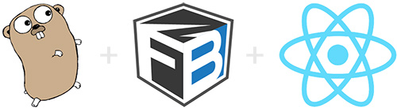

# go-fusebox-react
**Fusebox** is a new bundler, a competitor of Webpack!

This is a React bundle being built by Fusebox, and being served through a Go server 🔥

1. Run `npm install` to install packages
2. Run `node fuse` to build the bundle using fusebox
3. **(If you want HMR, do this step in a separate tab)**, run `go run server.go`
